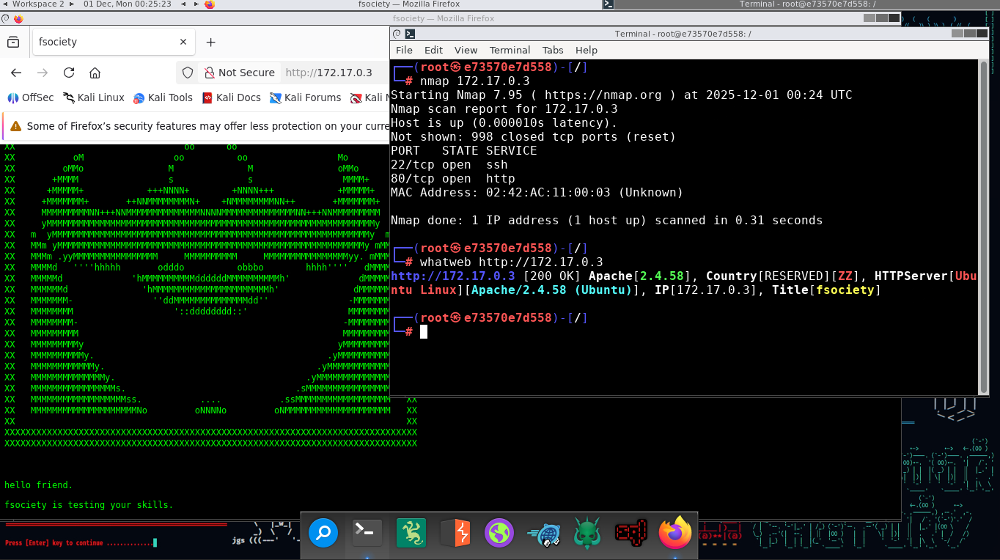
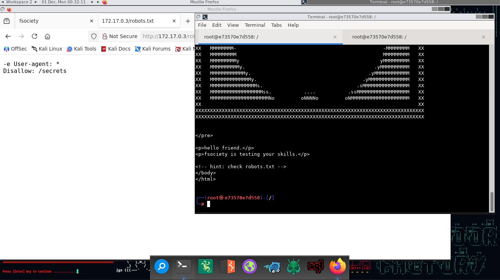
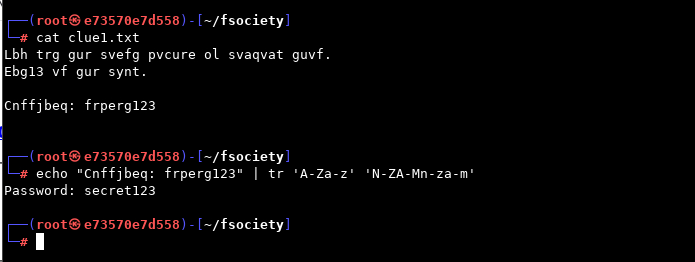
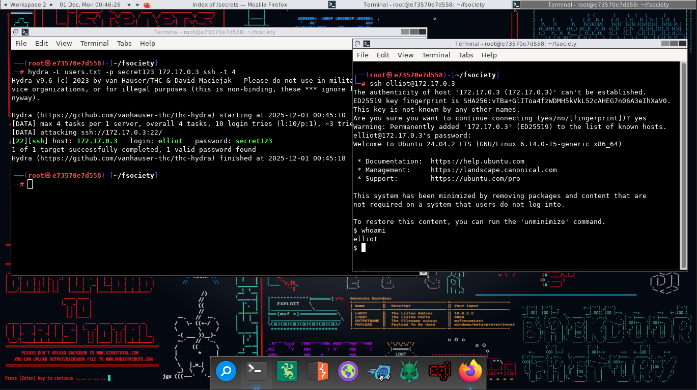
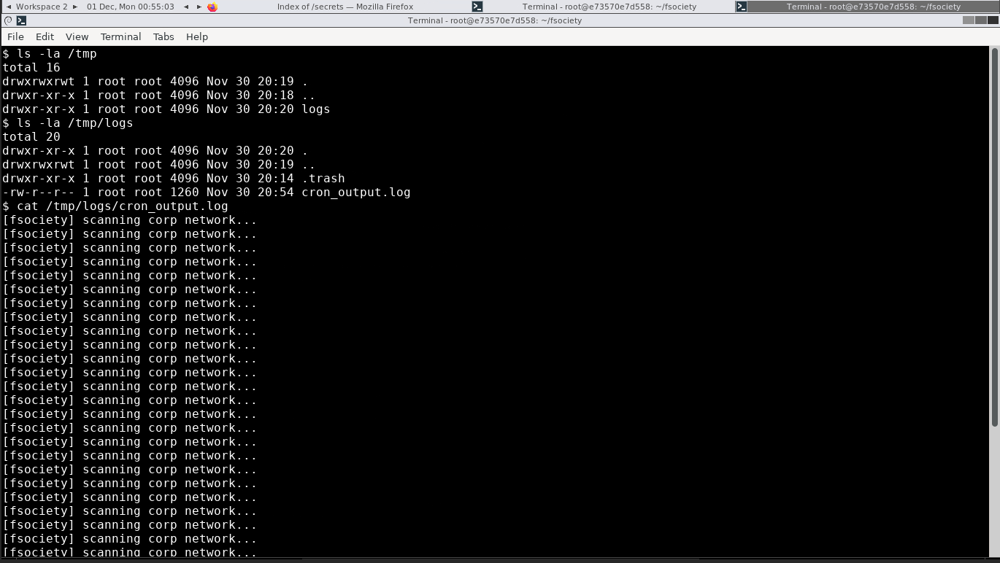
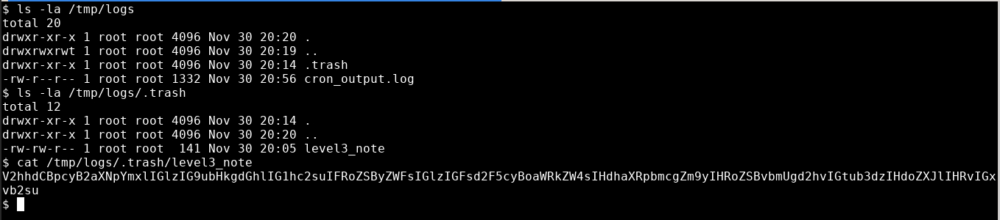
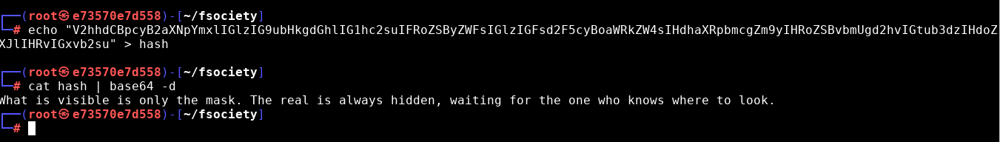
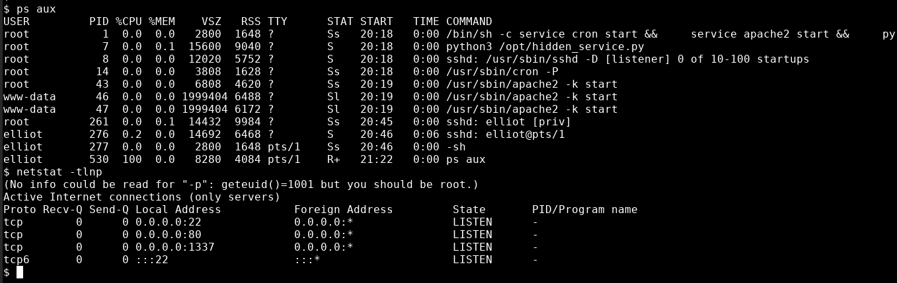
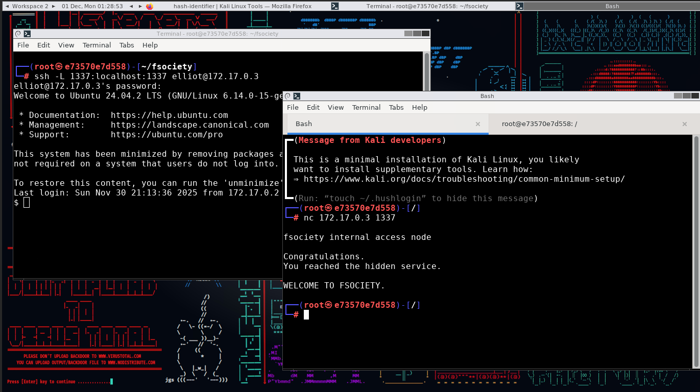

# **Reconocimiento inicial**
Usando nmap se analizo la direccion ip de la pagina y se encontraron dos puertos expuestos.
El puerto 80 es un servicio web apache y el puerto 22 es un servicio de ssh.


# **NIVEL 1 — “HELLO FRIEND”**

Explorando el codigo de la web se puede ver una pista que dirige hacia el archivo 'robots.txt'.
Teniendo este una ruta hacia el directorio '/secrets' que contiene un archivo llamado clue1.txt.


Descurbiendo que este esta cifrado en **ROT13** se puede ver el mensaje original se puede ver el contexto, viendo que el mensaje incluye una clave.


Teniendo una especie de clave se logro intuir que pertenecia a algun usuario de el sistema, el cual se podria suplantar usando el servicio ssh.
Se creo una lista de usuarios, tomando los nombres de los miembros de el grupo fsociety:

```bash
elliot
mrRobot
darlene
angela
tyrell
whiterose
dominique
Irving
gideon
shayla
```
Usando hydra para fuerza bruta se logro identificar al usuario elliot con la clave pass123.
Consiguiendo el acceso a la maquina


# **NIVEL 2 — “ARE YOU A ONE OR A ZERO?”**

Dentro de la maquina se empezo a listar directorios, encontrando el directorio '.hidden' el cual contiene mas archivos.
Un archivo en python y otro en texto plano, los cuales dan mensajes.
El archivo 'level2_note' deja ver una pista, haciendo alucion a que hay algo importante ne los logs


Dentro de '/tmp' se encontro una carpeta con logs donde se pueden ver unos datos irrelevantes.
Dentro de '/.trash' se encuentra otro archivo '/level3_note' el cual contiene un mensaje cifrado.



# **NIVEL 4 — “WELCOME TO FSOCIETY”**

El mensaje esta en **BASE64** y desencriptandolo se puede observar un mensaje que parece un acertijo.
Este mensaje hace alucion a "lo oculto" y "los conocimientos" lo cual motiva a buscar servicios y puertos ocultos.


Dentro de los servicios y puertos de el sistema se puede ver uno nuevo, el puerto 1337 esta abierto y en escucha.
Haciendo un port forwarding (usando ssh para mayor facilidad) para acceder a este servicio desde la maquina atacante y usar netcat para interactuar con este puerto.
Logrando ver le mensaje de bienvenida de el grupo fsociety.

 
